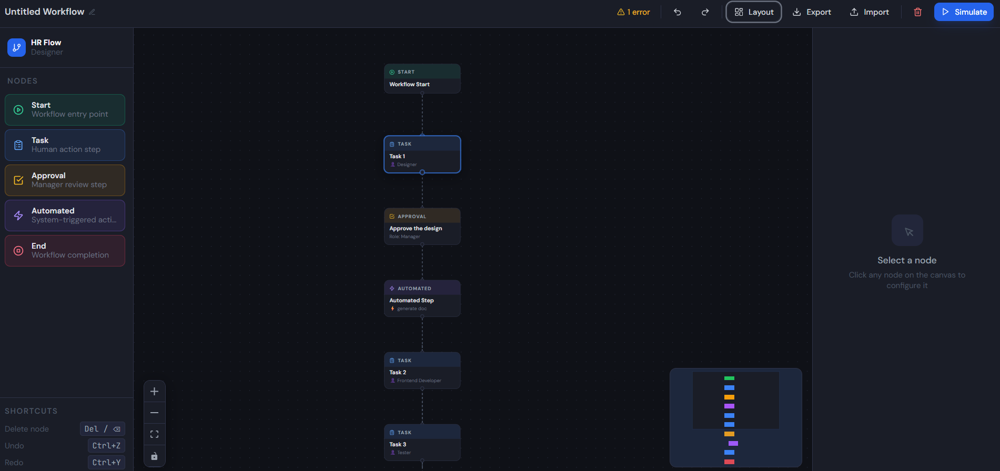
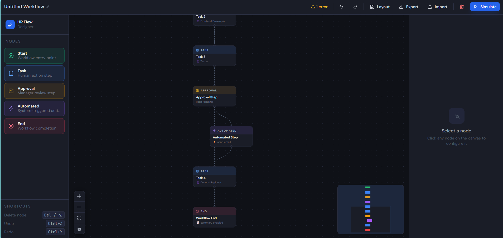
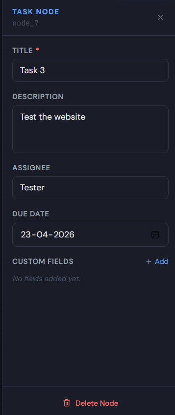
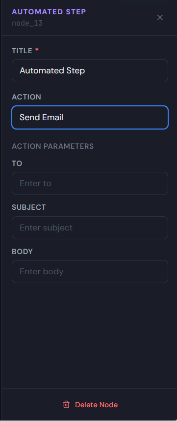
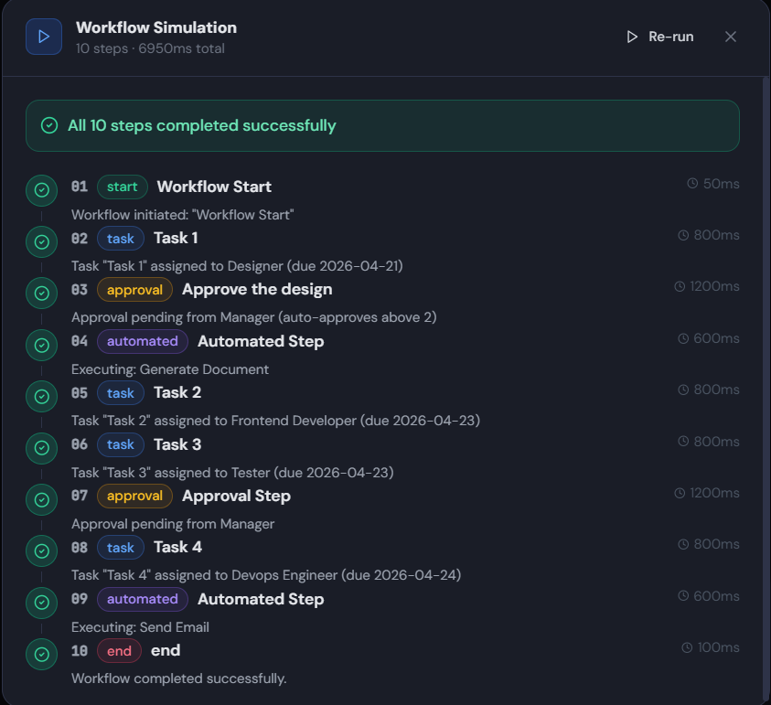

<div align="center">

# HR Workflow Designer

**A professional visual workflow builder for HR teams — built with React, TypeScript, and React Flow.**

Designed, configured, and simulated internal HR workflows—such as employee onboarding, leave approval, and document verification—using a mock API layer integrated with Mock Service Worker (MSW).

<br />

[](https://react.dev)
[](https://www.typescriptlang.org)
[](https://reactflow.dev)
[](https://zustand-demo.pmnd.rs)
[](https://tailwindcss.com)
[](https://jestjs.io)
[](https://vitejs.dev)

<br />

[Features](#features) · [Demo](#live-demo) · [Quick Start](#quick-start) · [Architecture](#architecture) · [Testing](#testing) · [Design Decisions](#design-decisions)

</div>

---

## Live Demo

> 🔗 **[app link](link)**

---

## Screenshots





**Node configuration panel**





<br />

<!-- SCREENSHOT 3: Simulation results -->
<!--  -->

**Simulation Panel**



---

## Features

### Core Workflow Builder
- **Drag-and-drop canvas** — drag 5 node types from the sidebar onto an infinite canvas
- **Visual connections** — connect nodes with animated directional edges
- **Live node configuration** — click any node to open a real-time form panel that updates the canvas as you type
- **Delete nodes and edges** — via button or `Delete` / `Backspace` key
- **Inline workflow naming** — click the workflow name in the toolbar to rename it

### Five Node Types
| Node | Color | Purpose |
|---|---|---|
| **Start** | 🟢 Emerald | Workflow entry point with optional metadata |
| **Task** | 🔵 Blue | Human action with assignee, due date, custom fields |
| **Approval** | 🟡 Amber | Manager review with role and auto-approve threshold |
| **Automated Step** | 🟣 Violet | System action chosen from a live API list with dynamic parameters |
| **End** | 🔴 Red | Workflow completion with summary flag |

### Mock API Layer (MSW)
- `GET /automations` — returns 6 configurable automation actions
- `POST /simulate` — accepts full workflow graph, runs real BFS traversal, returns step-by-step execution log
- Zero backend required — runs entirely in the browser via Service Worker

### Workflow Simulation
- Serializes the entire canvas graph and POSTs it to the mock API
- Validates structure: missing start/end nodes, disconnected nodes, cycles
- Displays animated step-by-step execution timeline with node type, title, message, and mock duration

### Real-Time Validation
- Validates on every graph change (no submit button)
- Error badges (`!`) appear directly on invalid nodes on the canvas
- Toolbar displays total error count with severity
- Checks: missing start/end, multiple start nodes, disconnected nodes, cycles, empty required fields

### Bonus Features
- ✅ **Undo / Redo** — `Ctrl+Z` / `Ctrl+Y` full canvas history via `zundo`
- ✅ **Auto Layout** — one-click dagre top-to-bottom node arrangement
- ✅ **Export JSON** — download current workflow as a versioned `.json` file
- ✅ **Import JSON** — restore any previously exported workflow
- ✅ **MiniMap** — color-coded overview panel
- ✅ **Keyboard Shortcuts** — `Delete`, `Ctrl+Z`, `Ctrl+Y`

---

## Quick Start

### Prerequisites
- Node.js 18+
- npm 9+

### Installation

```bash
# 1. Clone the repository
git clone https://github.com/YOUR_USERNAME/hr-workflow-designer.git
cd hr-workflow-designer

# 2. Install dependencies
npm install

# 3. Generate the MSW service worker (required — run once)
npx msw init public/ --save

# 4. Start the development server
npm run dev
```

Open **http://localhost:5173** in your browser.

You should see in the DevTools console:
```
[MSW] Mock API ready — /automations and /simulate are intercepted
```

### Available Scripts

```bash
npm run dev          # Start development server with hot reload
npm run build        # Production build
npm run preview      # Preview production build locally
npm test             # Run all Jest tests once
npm run test:watch   # Run tests in watch mode
npm run test:coverage # Run tests with coverage report
```

---

## How to Use

### Building a Workflow

1. **Drag** a node type from the left sidebar onto the canvas
2. **Connect** nodes by hovering over a handle (dot) on a node edge and dragging to another node
3. **Configure** a node by clicking it — the form panel opens on the right
4. **Delete** a node by clicking "Delete Node" in the form panel or pressing `Delete`
5. **Undo/Redo** with `Ctrl+Z` / `Ctrl+Y`
6. **Auto-arrange** all nodes by clicking "Layout" in the toolbar

### Running a Simulation

1. Build a connected workflow with at least a Start and End node
2. Click the **Simulate** button in the top toolbar
3. The simulation panel slides up showing a step-by-step execution log
4. If the workflow has errors (disconnected nodes, missing start/end) they appear here
5. Click **Re-run** to simulate again after making changes

### Export and Import

- Click **Export** (↓ icon) to download the current workflow as `workflow-{timestamp}.json`
- Click **Import** (↑ icon) to load a previously exported workflow file

---

## Architecture

```
src/
├── api/                    # Data layer — typed fetch wrappers
│   ├── client.ts           # Base fetch wrapper (get/post)
│   ├── automations.ts      # getAutomations() → GET /automations
│   └── simulation.ts       # postSimulate() → POST /simulate
│
├── mocks/                  # Mock API (MSW)
│   ├── handlers.ts         # Route handlers with real BFS simulation logic
│   └── browser.ts          # MSW worker setup
│
├── types/
│   └── workflow.ts         # All TypeScript interfaces and discriminated unions
│
├── utils/                  # Pure, framework-free utility functions
│   ├── graphValidation.ts  # hasCycle (DFS), validateWorkflow, buildNodeErrorMap
│   ├── workflowSerializer.ts # exportWorkflow, importWorkflow, downloadWorkflowFile
│   └── autoLayout.ts       # Dagre layout algorithm wrapper
│
├── hooks/                  # Custom React hooks
│   ├── useWorkflowStore.ts # Zustand store with zundo undo/redo
│   ├── useAutomations.ts   # Fetches GET /automations with loading/error state
│   ├── useSimulation.ts    # Handles POST /simulate lifecycle
│   ├── useWorkflowValidation.ts # Reactive validation → nodeErrorMap
│   └── useKeyboardShortcuts.ts  # Delete, Ctrl+Z, Ctrl+Y
│
└── components/
    ├── nodes/              # React Flow custom node components
    │   ├── BaseNode.tsx    # Shared wrapper: error badge, accent stripe, layout
    │   ├── StartNode.tsx
    │   ├── TaskNode.tsx
    │   ├── ApprovalNode.tsx
    │   ├── AutomatedStepNode.tsx
    │   ├── EndNode.tsx
    │   └── index.ts        # nodeTypes map (defined outside components)
    │
    ├── forms/              # Node configuration forms
    │   ├── NodeFormPanel.tsx       # Container — switches on node type
    │   ├── StartNodeForm.tsx
    │   ├── TaskNodeForm.tsx
    │   ├── ApprovalNodeForm.tsx
    │   ├── AutomatedStepNodeForm.tsx
    │   ├── EndNodeForm.tsx
    │   └── shared/
    │       ├── Field.tsx           # Label + input wrapper + error display
    │       └── KeyValueEditor.tsx  # Reusable key-value pair editor
    │
    ├── canvas/
    │   ├── WorkflowCanvas.tsx  # ReactFlow wrapper with drag-drop
    │   ├── Sidebar.tsx         # Draggable node palette
    │   └── Toolbar.tsx         # Undo/Redo, Layout, Export, Import, Simulate
    │
    ├── simulation/
    │   └── SimulationPanel.tsx # Step-by-step execution modal
    │
    └── ui/
        └── Button.tsx          # Shared button primitive
```

### Three-Layer Separation

```
┌─────────────────────────────────────────────────────┐
│  Components  (UI only — never calls fetch directly) │
└────────────────────────┬────────────────────────────┘
                         │ consumes
┌────────────────────────▼────────────────────────────┐
│  Hooks  (business logic, state, async lifecycle)    │
└────────────────────────┬────────────────────────────┘
                         │ consumes
┌────────────────────────▼────────────────────────────┐
│  API  (typed fetch wrappers — easy to swap for real)│
└─────────────────────────────────────────────────────┘
```

This means swapping the mock API for a real FastAPI/Node backend requires changing **only** the MSW handlers — zero changes to components or hooks.

---

## Design Decisions

### 1. Discriminated Union for Node Data

All node data types share a `type` field that TypeScript uses to narrow the union automatically:

```typescript
type WorkflowNodeData =
  | StartNodeData       // { type: 'start'; title: string; metadata: KeyValuePair[] }
  | TaskNodeData        // { type: 'task'; title: string; assignee: string; ... }
  | ApprovalNodeData    // { type: 'approval'; approverRole: string; ... }
  | AutomatedStepNodeData
  | EndNodeData;

// TypeScript narrows automatically:
if (node.data.type === 'task') {
  node.data.assignee // ✅ TypeScript knows this exists
  node.data.approverRole // ❌ TypeScript error — doesn't exist on TaskNodeData
}
```

**Adding a new node type** = add one interface, one form component, one node component, one case in `NodeFormPanel`. Zero changes to existing code.

### 2. Zustand + Zundo for Undo/Redo

Zustand keeps the entire canvas state flat and accessible from any component. Zundo's `temporal` middleware wraps it to track snapshots. History is scoped only to nodes/edges — not to selection state or the workflow name, which would create unnecessary undo steps.

```typescript
export const useWorkflowStore = create<WorkflowState>()(
  temporal(
    (set, get) => ({ /* store */ }),
    { partialize: (state) => ({ nodes: state.nodes, edges: state.edges }) }
  )
);
```

### 3. react-hook-form Watch Pattern for Live Auto-Save

Each form uses `watch()` to subscribe to all field changes and syncs them to Zustand on every keystroke. This means the canvas node title updates as you type — no save button needed.

```typescript
useEffect(() => {
  const subscription = watch(values => {
    updateNodeData(node.id, values as TaskNodeData);
  });
  return () => subscription.unsubscribe();
}, [watch, node.id, updateNodeData]);
```

### 4. BaseNode Abstraction

All 5 node types render through a shared `BaseNode` wrapper that handles the error badge (reads from the global validation hook), colored accent stripe, selection glow, and consistent layout. Adding a new node type requires zero changes to `BaseNode`.

### 5. Pure Utility Functions for Testability

`graphValidation.ts` and `workflowSerializer.ts` are pure functions — they take arrays and return values with no React, no DOM, no hooks. This makes them trivial to test in isolation and easy to reuse anywhere in the codebase.

---

## Testing

```bash
# Run all tests
npm test

# Watch mode
npm run test:watch

# With coverage
npm run test:coverage
```

### Test Results

```
PASS  src/__tests__/graphValidation.test.ts
PASS  src/__tests__/workflowSerializer.test.ts
PASS  src/__tests__/useWorkflowStore.test.ts
PASS  src/__tests__/TaskNodeForm.test.tsx

Test Suites: 4 passed, 4 total
Tests:       51 passed, 51 total
```

### Test Coverage

| File | What's Tested |
|---|---|
| `graphValidation.test.ts` | `hasCycle` — linear, branching, direct/indirect cycles, empty graph. `validateWorkflow` — missing start/end, multiple starts, disconnected nodes, cycles, empty titles. `buildNodeErrorMap` — correct node-to-error mapping |
| `workflowSerializer.test.ts` | Export produces valid JSON with correct schema. Import round-trips all nodes/edges with zero data loss. Error handling for invalid JSON, wrong version, missing fields |
| `useWorkflowStore.test.ts` | `addNode`, `deleteNode` (including edge cleanup), `updateNodeData`, `selectNode`, `clearWorkflow`, `setWorkflowName` |
| `TaskNodeForm.test.tsx` | Field rendering, pre-fill from node data, validation error on blur, live store updates on typing, KeyValueEditor add/remove |

---

## Tech Stack

| Technology | Version | Purpose |
|---|---|---|
| [React](https://react.dev) | 18 | UI framework |
| [TypeScript](https://www.typescriptlang.org) | 5 | Type safety throughout |
| [Vite](https://vitejs.dev) | 5 | Dev server and build tool |
| [React Flow](https://reactflow.dev) | 11 | Canvas, nodes, edges, drag-drop |
| [Zustand](https://zustand-demo.pmnd.rs) | 4 | Global state management |
| [Zundo](https://github.com/charkour/zundo) | 2 | Undo/redo history for Zustand |
| [react-hook-form](https://react-hook-form.com) | 7 | Form state management |
| [Zod](https://zod.dev) | 3 | Schema validation |
| [MSW](https://mswjs.io) | 2 | Browser-native mock API |
| [Dagre](https://github.com/dagrejs/dagre) | 0.8 | Graph auto-layout algorithm |
| [Tailwind CSS](https://tailwindcss.com) | 3 | Utility-first styling |
| [Lucide React](https://lucide.dev) | 0.383 | Icon library |
| [Jest](https://jestjs.io) | 29 | Test runner |
| [React Testing Library](https://testing-library.com) | 16 | Component testing |

---

## Keyboard Shortcuts

| Shortcut | Action |
|---|---|
| `Delete` / `Backspace` | Delete selected node |
| `Ctrl+Z` / `Cmd+Z` | Undo |
| `Ctrl+Y` / `Ctrl+Shift+Z` | Redo |

---

## What I Would Add With More Time

- **Conditional edges** — branch on approval outcome (Approved / Rejected paths)
- **Node templates** — save frequently used node configurations for reuse
- **E2E tests** — Playwright for full drag-drop, connection, and simulation flows
- **Storybook** — isolated component development and visual regression testing
- **Collaborative editing** — WebSocket-based real-time multi-user canvas
- **Node version history** — audit trail of configuration changes per node
- **Workflow versioning** — save and compare multiple versions of a workflow

---

## Project Context

Built as a case study submission for the **Tredence Analytics AI Engineering Internship**.

The brief: design and implement a mini HR Workflow Designer module using React, React Flow, modular frontend architecture, mock API integration, and scalable component design.

---

<div align="center">

Made with React, TypeScript, and React Flow For **Tredence Analytics**, Full Stack Engineer Intern

</div>